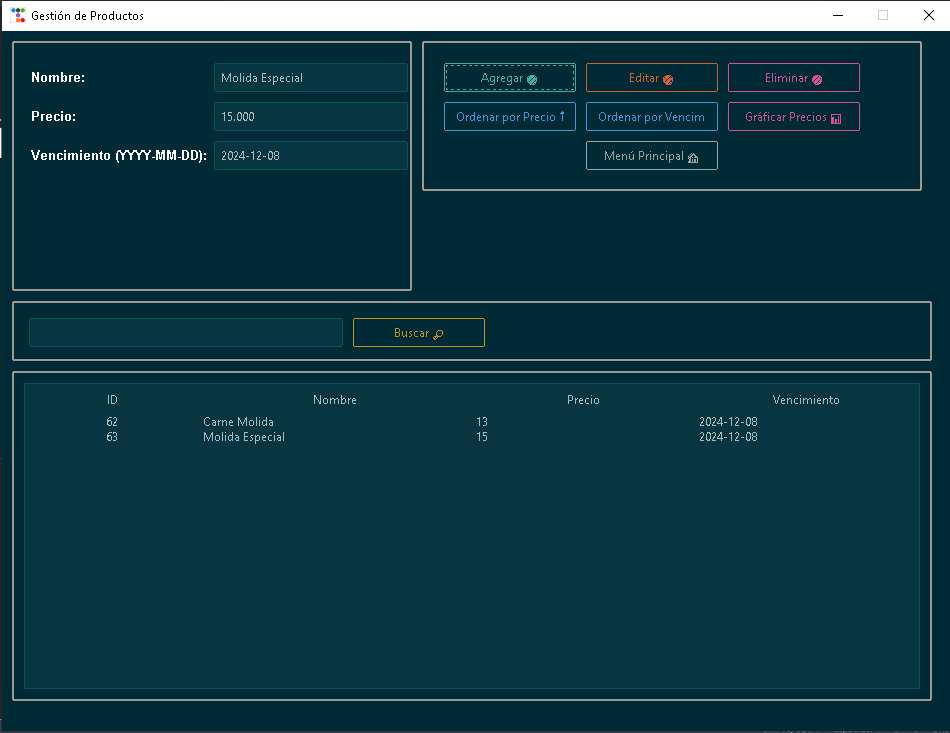
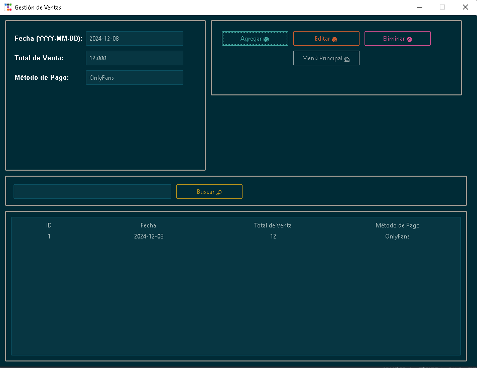

---

# Sistema de Gestión para Panadería

Este proyecto es una aplicación integral para gestionar productos, clientes, proveedores, materia prima y ventas en una panadería. Está desarrollada en **Python** con una interfaz gráfica construida en **Tkinter** y conecta con una base de datos **MySQL** para el almacenamiento de datos.

Durante el desarrollo, se utilizó **ChatGPT** como herramienta de asistencia para optimizar la generación de documentación, solución de problemas y estructuración de código. Esta herramienta permitió acelerar ciertos procesos, pero todas las funcionalidades fueron diseñadas, implementadas y personalizadas para cumplir con los objetivos del proyecto.


---

## Tabla de Contenidos

1. [Descripción General](#descripción-general)  
2. [Requisitos](#requisitos)  
3. [Instalación](#instalación)  
4. [Estructura del Proyecto](#estructura-del-proyecto)  
5. [Configuración de la Base de Datos](#configuración-de-la-base-de-datos)  
6. [Uso](#uso)  
7. [Funcionalidades](#funcionalidades)  
8. [Capturas de Pantalla](#capturas-de-pantalla)  
9. [Posibles Problemas y Soluciones](#posibles-problemas-y-soluciones)  
10. [Contribuciones](#contribuciones)  
11. [Licencia](#licencia)  
12. [Contacto](#contacto)  

---

### Descripción General

El sistema permite gestionar múltiples aspectos de la panadería, tales como:  
- Gestión de **productos** (agregar, editar, eliminar, ordenar y graficar precios).  
- Gestión de **clientes** (registro de clientes con datos básicos).  
- Gestión de **proveedores** (administrar contactos y descripciones).  
- Gestión de **materia prima** (marcas, nombres y peso de insumos).  
- Gestión de **ventas** (registro de fecha, total y método de pago).

La interfaz gráfica facilita la interacción con la base de datos, y las funcionalidades están organizadas en módulos separados para mantener un código limpio y reutilizable.

---

### Requisitos

- **Python** 3.x  
- **MySQL** (servidor de base de datos)  
- Bibliotecas adicionales:  
  ```bash
  pip install mysql-connector-python ttkbootstrap matplotlib
  ```

---

### Instalación

1. **Clona el repositorio**:  
   ```bash
   git clone https://github.com/romanmdo/manage-bakery.git
   ```

2. **Instala las dependencias**:  
   ```bash
   pip install -r requirements.txt
   ```

3. **Configura la base de datos**:  
   Ajusta las credenciales de acceso en el archivo `config/db_config.py`.

4. **Inicia la aplicación**:  
   ```bash
   python main.py
   ```

---

### Estructura del Proyecto

```
/sistema_panaderia
├── main.py                       # Código principal de la aplicación
├── gui
│   ├── gui_productos.py          # Interfaz para gestionar productos
│   ├── gui_clientes.py           # Interfaz para gestionar clientes
│   ├── gui_proveedores.py        # Interfaz para gestionar proveedores
│   ├── gui_materia_prima.py      # Interfaz para gestionar materia prima
│   ├── gui_ventas.py             # Interfaz para gestionar ventas
├── config
│   ├── db_config.py              # Configuración de conexión MySQL
│   ├── config_productos.py       # Funciones relacionadas con productos
│   ├── config_clientes.py        # Funciones relacionadas con clientes
│   ├── config_proveedores.py     # Funciones relacionadas con proveedores
│   ├── config_materia_prima.py   # Funciones relacionadas con materia prima
│   ├── config_ventas.py          # Funciones relacionadas con ventas
├── requirements.txt              # Dependencias del proyecto
└── README.md                     # Documentación
```

---

### Configuración de la Base de Datos

1. **Crear las tablas**:  
   Ejecuta el archivo SQL proporcionado (`db_tables.sql`) para crear la estructura completa de la base de datos.  

   ```sql
      create database panaderia;
      use panaderia;

      CREATE TABLE empleados(
      empleadosID INT auto_increment PRIMARY KEY COMMENT   'CLAVE PRIMARIA',
      nombre VARCHAR (25) NOT NULL   COMMENT 'NOMBRE DEL EMPLEADO, DATO NO NULO ',
      edad INT (2)   NOT NULL COMMENT 'LA EDAD  ',
      genero VARCHAR(20)   COMMENT 'PUEDE SER NULO ',
      telefono INT (10) NOT NULL
      );

      CREATE TABLE productos(
      productosID  INT  auto_increment PRIMARY KEY  ,
      nombre VARCHAR (50) NOT NULL,       
      precio DECIMAL  NOT NULL COMMENT 'el precio de los productos',
      vencimiento DATE  NOT NULL COMMENT  ' FECHAS DE VENCIMIENTO '
      );

      CREATE TABLE categoria(
      categoriaID INT auto_increment PRIMARY KEY   ,
      descripcion VARCHAR(50) NOT NULL  COMMENT  'DATO NECESARIO ',
      nombre VARCHAR (25) NOT NULL
      );

      CREATE TABLE proveedores(
      proveedoresID INT auto_increment PRIMARY KEY  ,
      nombre VARCHAR (25) NOT NULL,
      telefono INT (10)  NOT NULL,
      descripcion VARCHAR(50) NOT NULL
      );

      CREATE TABLE materia_prima(
      materia_primaID INT auto_increment PRIMARY KEY ,
      marca VARCHAR(15) NOT NULL,
      nombre VARCHAR (25) NOT NULL,
      peso DECIMAL
      );

      CREATE TABLE cliente (
      clienteID INT auto_increment PRIMARY KEY ,
      nombre VARCHAR (25) NOT NULL,
      apellido VARCHAR(50) NOT NULL,
      telefono INT (10),
      DNI INT (10)
      );

      CREATE TABLE venta(
      ventaID INT auto_increment PRIMARY KEY ,
      fecha DATE,
      total_de_venta DECIMAL,
      metodo_de_pago VARCHAR(15) NOT NULL
      );
   ```

2. **Ajustar credenciales**:  
   Edita `db_config.py` con los valores de conexión adecuados.

---

### Uso

1. Ejecuta la aplicación:  
   ```bash
   python main.py
   ```

2. Selecciona la sección que deseas usar:  
   - Gestión de productos.  
   - Administración de clientes.  
   - Manejo de proveedores.  
   - Control de materia prima.  
   - Registro de ventas.  

---

### Funcionalidades

- **Productos**:  
  - Agregar, editar y eliminar productos.  
  - Ordenar productos por precio o fecha de vencimiento.  
  - Graficar precios.  

- **Clientes**:  
  - Registrar clientes con datos básicos (nombre, apellido, DNI, etc.).  
  - Editar o eliminar clientes.  

- **Proveedores**:  
  - Registrar proveedores con descripción, nombre y teléfono.  

- **Materia Prima**:  
  - Administrar insumos básicos (marca, nombre, peso).  

- **Ventas**:  
  - Registrar ventas con total, fecha y método de pago.  

---

### Capturas de Pantalla

- **Gestión de productos**:  
  

- **Gestión de ventas**:  
  

---

### Posibles Problemas y Soluciones

1. **Error de conexión a la base de datos**:  
   - Verifica las credenciales en `db_config.py`.  
   - Asegúrate de que el servidor MySQL esté en ejecución.  

2. **Problemas con las dependencias**:  
   - Usa el comando `pip install -r requirements.txt`.  

3. **Interfaz gráfica no responde**:  
   - Verifica la instalación de `ttkbootstrap` y `tkinter`.  

---

### Contribuciones

Contribuciones, reportes de errores o sugerencias son bienvenidos. Sigue estos pasos:  
1. Haz un fork del proyecto.  
2. Crea una rama nueva (`git checkout -b feature/tu_funcionalidad`).  
3. Haz un pull request con tus cambios.  

---

### Licencia

Este proyecto está licenciado bajo la **Licencia MIT**. Consulta el archivo `LICENSE` para más detalles.

---

### Contacto

Si tienes dudas o sugerencias, puedes contactarme en:  
- **Email**: [romanmdo912@gmail.com](mailto:romanmdo912@gmail.com)  
- **GitHub**: [Mi Perfil](https://github.com/romanmdo/)

--- 